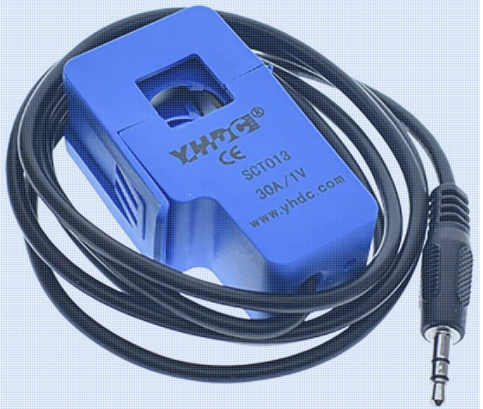

## XBee3 Laundry Monitor
### Micropython code running on an XBee3 ZigBee RF module to read ADC values from CT sensors on washer and dryer A/C circuits.

In order to monitor the state of my home's laundry and be notified when the washer and dryer laods are complete, I use a current transformer (CT) sensor to detect each appliance's power state (i.e. whether CT voltage detected via ADC pins).

This requires turning off your home's main power, removing the circuit breaker panel cover, and clipping the CT sensors to each laundry circuit (I'm in the US and used the black hot wires). Removing your panel is obviously dangerous and if you're not careful your family could find you a smoking heap on the ground. So be careful.

The circuit to detect the power state uses a **SCT-013-030 30A Non-invasive AC Current Sensor Split-Core Current Transformer**, a bearing resistor, and a capacitor. The 12 bit XBee3 ADC reads the voltage across the resistor.

The XBee3 sends the ADC readings to the ZigBee coordinator. I use custom coordinator code based on [aioxbee](https://github.com/idatum/aioxbee). The coordinator code publishes each ADC reading to an MQTT broker. The state of the washer and dryer are also published. The state is based on a moving window of ADC values crossing a threshold. In my case the moving window is the sum of the last 10 ADC readings and the threshold "on" state is a value of 1000.

I use [Home Assistant](https://github.com/home-assistant) (HA) to integrate each state as a binary_sensor. HA gives me a convenient UX to read and control the binary sensors. I use HA automation as a simple way to be notified when the laundry is done (e.g. Twilio integration).

### Schematic

* R1 and R2: 33 ohms
* C1 and C2: 10 microfarads
* J1 and J2 connect to each CT.

### Example of a CT sensor

### MQTT binary sensors for Home Assistant
    - platform: mqtt
      name: "Washer"
      device_class: "power"
      unique_id: "xbee3-laundry-CT-sensor-washer"
      state_topic: "Laundry/washer"
      payload_on: "on"
      payload_off: "off"
      qos: 0
    - platform: mqtt
      name: "Dryer"
      device_class: "power"
      unique_id: "xbee3-laundry-CT-sensor-dryer"
      state_topic: "Laundry/dryer"
      payload_on: "on"
      payload_off: "off"
      qos: 0