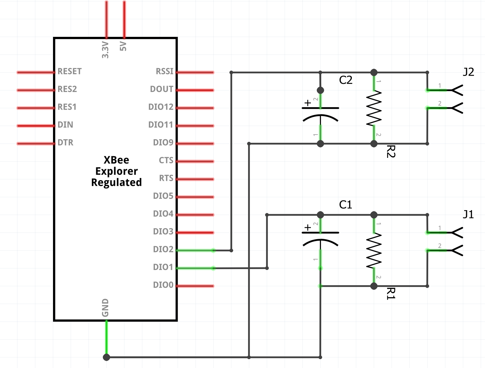

## XBee3 Laundry Monitor
### Micropython code running on an XBee3 ZigBee RF module to read ADC values from CT sensors on washer and dryer A/C circuits.

### Circuit ###
In order to monitor the state of my home's laundry and receive notification when the washer and dryer are done, I use a current transformer (CT) sensor to detect each appliance's power state (i.e. whether CT voltage is detected via ADC pins).

The goal was to avoid any physical modifications to the high ampere/voltage circuits for these appliances. I also wanted to avoid using wireless switch plugs (e.g. Z-Wave) capable of sending energy usage telemetry, especially on the 240VAC (US) dryer outlet.

Installation requires turning off your home's main power, removing the circuit breaker panel cover, and clipping the CT sensors to each laundry circuit (I am in the US and use the red and black hot wires). Removing your panel is obviously dangerous and if you're not careful your family could find you as a smoking heap on the ground. So be careful.

The circuit to detect the power state uses a **SCT-013-030 30A Non-invasive AC Current Sensor Split-Core Current Transformer**, a load bearing resistor, and a capacitor. The XBee3 12-bit ADC pins read the voltage across each resistor.

### Custom code ###
The XBee3 sends the ADC readings to the ZigBee coordinator of the mesh network about every 10 seconds. I use custom coordinator code based on [aioxbee](https://github.com/idatum/aioxbee). The coordinator code publishes both ADC readings in the payload of a single topic sent to an MQTT broker. Each state for the washer and dryer are published as a seperate topic when a state changes between on or off.

The state of the washer and dryer is based on a moving window of ADC values crossing a threshold. In my case the moving window is the average of the last 20 ADC readings and the threshold "on" state is a value of 20.

I do pre-aggregation of ADC samples on the XBee3 before transmitting. A remotely configurable global variable `Sum_count` defaults to 5. The idea is to 1) collect a reasonable signal before sending, 2) minimize the frequency of MQTT messages.

### Data analysis ###
Once I gathered a weekend's worth of data from my family and myself doing our laundry, I was able to arrive at default aggregation count and threshold value settings.

As mentioned, I use a moving window of ADC values -- these ADC values are already aggregated (5 consecutive ADC samples) by the XBee3 code.

My choices for calculating the threshold values were 1) sum, 2) average, 3) percentile. I created a spreadsheet of the collected readings and did some comparisons of the three choices, and arrived at a window size of **20** readings and a threshold value of **20** based on the **average** of those readings.

Here's what a spreadsheet shows for the 20-readings window when the washer (W) threshold is crossed (i.e. the washer is on) while the dryer (D) is off:

| Secs | W | D | SUM(W)  | SUM(D) | SUM(W) > 475 | SUM(D) > 475 |  |  | | AVG(W)  | AVG(D) | AVG(W) > 20 | AVG(D) > 20 |  |  |  | P90(W)  | P90(D) | P90(D) > 70 | P90(D) > 70 |
|-----------------------------|---|----|------|-----|-------|-------|--|--|--|-------|------|-------|-------|--|--|--|-------|------|-------|-------|
| 0 | 3 | 5  | 436  | 139 | FALSE | FALSE |  |  |  | 9     | 5.45 | FALSE | FALSE |  |  |  | 17.4  | 13.8 | FALSE | FALSE |
| 10 | 6 | 3  | 680  | 150 | **TRUE**  | FALSE |  |  |  | 19.05 | 5.25 | FALSE | FALSE |  |  |  | 72.9  | 13.8 | **TRUE**  | FALSE |
| 20 | 7 | 2  | 686  | 148 | TRUE  | FALSE |  |  |  | 19.85 | 5.2  | FALSE | FALSE |  |  |  | 73.3  | 13.8 | TRUE  | FALSE |
| 30 | 0 | 1  | 691  | 148 | TRUE  | FALSE |  |  |  | 19.7  | 6.2  | FALSE | FALSE |  |  |  | 73.3  | 16.7 | TRUE  | FALSE |
| 40 | 6 | 3  | 694  | 149 | TRUE  | FALSE |  |  |  | 21    | 6.4  | **TRUE**  | FALSE |  |  |  | 73.7  | 16.7 | TRUE  | FALSE |
| 50 | 1 | 17 | 701  | 155 | TRUE  | FALSE |  |  |  | 33.05 | 7.05 | TRUE  | FALSE |  |  |  | 191.5 | 16.9 | TRUE  | FALSE |

Here are the thresholds for each option with 20 readings:
1. SUM of 475
2. AVG of 20
3. P90 of 70

Notice that over the 60 seconds or so both the SUM and P90 cross their threshold before AVG.

Here's the spreadsheet after the laundry was physically transferred from the washer (now done) to the dryer and the dryer is started:
| Secs | W | D | SUM(W)  | SUM(D) | SUM(W) > 475 | SUM(D) > 475 |  |  | | AVG(W)  | AVG(D) | AVG(W) > 20 | AVG(D) > 20 |  |  |  | P90(W)  | P90(D) | P90(W) > 70 | P90(D) > 70 |
|-----------------------------|-----|---|------|-------|-------|-------|--|--|--|--------|-------|-------|-------|--|--|--|-------|--------|-------|-------|
| 100 | 194 | 5 | 1615 | 115   | TRUE  | FALSE |  |  |  | 79.3   | 4.85  | TRUE  | FALSE |  |  |  | 426.2 | 13.4   | TRUE  | FALSE |
| 110 | 490 | 0 | 1429 | 1564  | TRUE  | **TRUE**  |  |  |  | 69.6   | 4.7   | TRUE  | FALSE |  |  |  | 424.3 | 13.4   | TRUE  | FALSE |
| 120 | 118 | 2 | 954  | 3977  | TRUE  | TRUE  |  |  |  | 46.1   | 4.9   | TRUE  | FALSE |  |  |  | 169.3 | 13.4   | TRUE  | FALSE |
| 130 | 175 | 4 | 841  | 6385  | TRUE  | TRUE  |  |  |  | 40.3   | 4.8   | TRUE  | FALSE |  |  |  | 160.1 | 13.4   | TRUE  | FALSE |
| 140 | 452 | 6 | 674  | 8791  | TRUE  | TRUE  |  |  |  | 31.9   | 5.2   | TRUE  | FALSE |  |  |  | 25.4  | 13.8   | **FALSE** | FALSE |
| 150 | 6   | 7 | 233  | 11210 | **FALSE** | TRUE  |  |  |  | 9.7    | 77.6  | **FALSE** | **TRUE**  |  |  |  | 19.9  | 17.6   | FALSE | FALSE |
| 160 | 13  | 2 | 239  | 13316 | FALSE | TRUE  |  |  |  | 10.15  | 197.9 | FALSE | TRUE  |  |  |  | 19.9  | 1310.4 | FALSE | **TRUE**  |

Again, each choice of threshold calculation crosses its threshold at different times. SUM lags enough to overlap briefly.

I ultimately decided on AVG over P90 because of the simplicity of the calculation.

### Home Assistant integration ###
I use [Home Assistant](https://github.com/home-assistant) (HA) to control and display laundry notifications, state, and data. An HA MQTT binary_sensor integrates washer and dryer state. An MQTT sensor shows the current ADC raw readings, which conventiently creates a line chart. HA generally is a convenient integration point and UI for these types of DIY projects, and provides the glue for integrating with other home automation devices.

For notifications, I use HA automation triggered by the binary_sensor state change. The HA app on my phone is especially useful for recieving and enabling/disabling notifications. In the laundry room I have an NFC tag that toggles notifications on and off. Once my laundry is done, I don't need to be notified of other family members' laundry status!

### Schematic

* R1 and R2: 33 ohms
* C1 and C2: 10 microfarads
* J1 and J2 connect to each CT.

### Example of a CT sensor

### MQTT binary sensors for Home Assistant
    - platform: mqtt
      name: "Washer"
      device_class: "power"
      unique_id: "xbee3-laundry-CT-sensor-washer"
      state_topic: "Laundry/washer"
      payload_on: "on"
      payload_off: "off"
      qos: 0
    - platform: mqtt
      name: "Dryer"
      device_class: "power"
      unique_id: "xbee3-laundry-CT-sensor-dryer"
      state_topic: "Laundry/dryer"
      payload_on: "on"
      payload_off: "off"
      qos: 0
